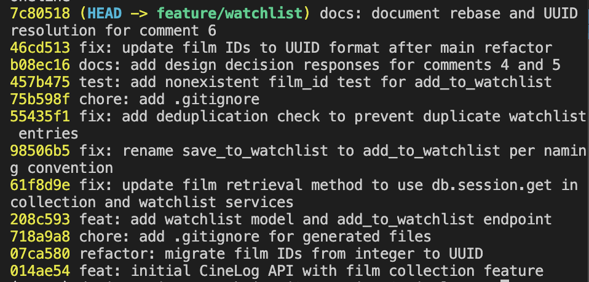

# PR Response Doc — CineLog Watchlist Feature

## AI Usage

Used Claude throughout for: understanding the codebase before touching
review comments (tracing add_to_collection()'s pattern, the models,
test structure); working through Comments 4 and 5 by being asked
follow-up questions rather than given answers, which pushed me to
articulate my own reasoning (the video-store analogy and the
guilty-pleasure-films point in Comment 4 were mine, refined through
that back-and-forth); and git troubleshooting during the interactive
rebase, including recovering from a rebase mistake using git reflog
after a --root rebase accidentally moved HEAD unexpectedly.

## Comment 1 — Rename

**What I did:** Renamed `save_to_watchlist()` to `add_to_watchlist()` in `services/watchlist_service`.py to match the verb_to_noun convention used by `add_to_collection()`. Updated the import and call site in `routes/watchlist.py.

**How I verified:** Confirmed the app starts without ImportError after the rename, and the route still calls the function correctly.

## Comment 2 — Deduplication

**What I did:** Added in AlreadyInWatchlistError exception and a check in `add_to_watchlist()` that queries for an existing WatchlistEntry before creating a new one, mirroring the pattern in `add_to_collection()`.

**How I verified:** In flask shell, called `add_to_watchlist()` with the same user_id/film_id twice. First call succeeded and returned a new entry. Second call raised AlreadyInWatchlistError with the message "Film '1' is already in this user's watchlist" - confirmed via try/except.

## Comment 3 — Missing test

**What I did:** Created tests/test_watchlist.py with test_add_to_watchlist_nonexistent_film_raises, modeled directly on test_add_to_collection_nonexistent_film_raises from test_collection.py. Copied the app and sample_user fixtures into the new file since pytest fixtures aren't shared across files without a conftest.py.

**How I verified:** Ran pytest tests/test_watchlist.py -v - passed. Then ran the full suite (pytest tests/ -v) - all 5 tests passed, confirming nothing else broke

## Comment 4 — Default visibility

**My position:** Watchlists should default to `public=False` (private), not `public=True`.

**Reasoning:** Adding a film to a watchlist is a personal act - "I want to watch this" - not a social announcement. Most users add films for their own tracking, not because they intend to broadcast their taste. Defaulting to private respects that intent and lets a user opt into sharing deliberately, rather than assuming visibility they never chose.

**Tradeoff acknowledged:** CineLog's stated goal is a social, community-driven discovery experience, and public-by-default would serve that directly - friends could see what others want to watch without any manual step. But public by default risks quietly shaping what people add in the first place: if a list is visible from the start, users may avoid adding guilty-pleasure or low-rated films they'd otherwise track honestly, which undermines the authenticity of the discovery feature it's meant to support. A useful analogy is a video store's "staff picks" shelf - it worked because it was a deliberate, intentional act of curation and sharing, not someone's private rental history made public by default. Private-by-default preserves that same option: a user can still choose to share a list, but starts from a place of control rather than exposure.

## Comment 5 — Sort order

**My position:** Sort by date_added, newest first - matching @dev-lead's suggestion.

**Reasoning:** Alphabetical order buries everything equally, regardless of how recently it was added - a title starting with 'A' sits at the top forever, while something added yesterday can be invisible if it starts with 'Z.' There's no signal of freshness at all. Sorting newest-first matches how people actually use a watchlist: a film added last week is usually there because something just reminded the user of it - a trailer, a friend's recommendation, a mood - and that recency is exactly why it's more likely to be what they're in the mood for tonight. The list should surface what's top of mind, not force a user to scan alphabetically for it.

**Engagement with reviewer's point:** I agree directly with @dev-lead's reasoning - "most users want to see what they added recently" matches how I'd actually use this feature myself. I'll note one nuance: there's a separate, real use case for browsing older, buried entries when a user is feeling picky rather than decisive - but that's a browsing behavior, not a default-view behavior. Newest-first should remain the default; a future alphabetical or "surprise me" view could serve that browsing case without changing what a user sees on first load.

## Comment 6 — Rebase

**What conflicted:** Running `git rebase origin/main` hit one real conflict, in `.gitignore` (main had added a `.pytest_cache/` line mine doesn't have) - resolved by keeping both sets of entries.
The bigger issue wasn't a conflict git flagged at all: main's UUID refactor commit rewrote `models.py` from scratch, and since `WatchlistEntry` only ever existed on my branch, the rebase silently dropped it - no conflict marker, just a missing class. I only caught this by running the full test suite after rebasing and getting an ImportError.

**How I resolved it:** Re-added `WatchlistEntry` to `models.py`, using `db.String(36)` for `film_id` to match the new UUID convention (was `db.Integer`). Also updated `services/watchlist_service.py`'s docstring, which still said "integer - pre-refactor," and fixed `tests/test_watchlist.py`'s `fake_film_id` from an integer (`9999999`) to a UUID-shaped string, matching the pattern in `test_collection.py`.

**How I verified no conflict remains:** Ran `pytest tests/ -v` after the rebase - all 5 tests passed. This caught the missing `WatchlistEntry` class immediately (ImportError on collection), which a clean `git rebase` output alone would not have revealed.

## PR Description

Adds a watchlist feature to CineLog — users can save films they want to
watch later, separate from their collection of films already watched.

**What it does:**
- New `WatchlistEntry` model, linked to `User` and `Film`
- `add_to_watchlist(user_id, film_id)` — adds a film to a user's
  watchlist, following the same `verb_to_noun` convention and
  duplicate-prevention pattern as `add_to_collection()`
- `GET /watchlist/<user_id>` — returns a user's watchlist
- `POST /watchlist/<user_id>/add` — adds a film to a user's watchlist

**Design decisions:**
- **Default visibility:** watchlists default to `public=False` (private).
  Adding a film is a personal act, not a social one — defaulting private
  respects that and lets users opt into sharing deliberately, rather than
  assuming visibility they never chose. Full reasoning in `pr-response.md`.
- **Sort order:** watchlists are sorted by `date_added`, newest first,
  rather than alphabetically. This matches how users actually engage with
  a watchlist — a recently added film is more likely to be top of mind.
  Full reasoning in `pr-response.md`.

**How to manually test:**
1. `python app.py`
2. In `flask shell`, create a user and film if the DB is empty:
```python
   from models import User, Film
   from app import db
   u = User(username="tester", email="tester@example.com")
   f = Film(title="Test Film", year=2020, genre="Drama")
   db.session.add_all([u, f])
   db.session.commit()
   print(u.id, f.id)
```
3. `POST /watchlist/<user_id>/add` with body `{"film_id": "<film_id>"}`
   — should return `201` with the new entry.
4. Repeat the same request — should raise `AlreadyInWatchlistError`,
   confirming no duplicate is created.
5. `GET /watchlist/<user_id>` — should return the film, sorted by most
   recently added first.
6. Run `pytest tests/ -v` — all tests should pass, including
   `test_add_to_watchlist_nonexistent_film_raises`.

   